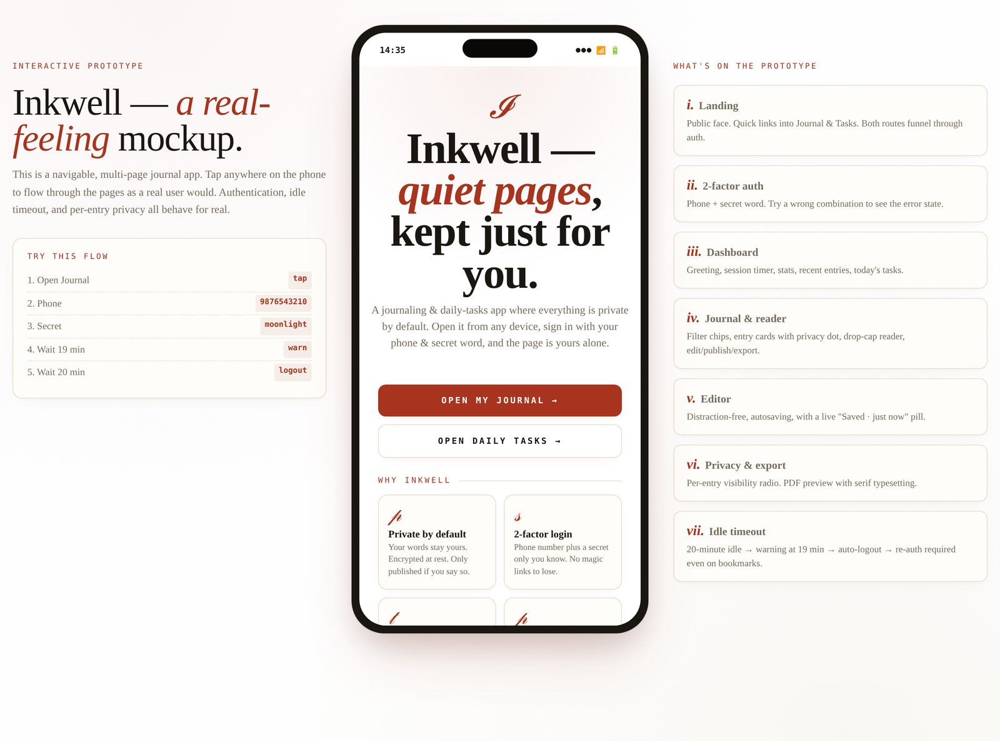

# Private Journal — Next.js full-stack app

A privacy-first journaling and daily-tasks web app, built with Next.js 15
(App Router), Postgres, and Argon2id auth.

> Two-factor sign-in (phone + secret word). 20-minute idle timeout.
> Per-entry visibility. Bookmark-resistant auth wall.



## Quick start

```bash
# 1. Install dependencies
npm install

# 2. Copy the env template and fill in values
cp .env.example .env.local
#   -> get DATABASE_URL from neon.tech (free)
#   -> generate JWT_SECRET:  openssl rand -hex 32
#   -> generate PHONE_SALT:  openssl rand -hex 16

# 3. Set up the database tables
npm run db:setup

# 4. Run the dev server
npm run dev
```

Visit <http://localhost:3000>.

The first time, click **Create an account →**, pick a phone number and a
secret word, and you're in.

## Deployment to Vercel

1. Push this repo to GitHub.
2. Sign up at <https://vercel.com> with your GitHub account.
3. **Add New… → Project**, pick the repo, click **Deploy**.
4. In Vercel: **Project → Settings → Environment Variables** — add
   `DATABASE_URL`, `JWT_SECRET`, `PHONE_SALT`, `IDLE_TIMEOUT_MINUTES`,
   `ALLOW_SIGNUP`.
5. Redeploy. Visit `https://your-app.vercel.app`.

That's it. Free for hobby projects, never sleeps, scales globally.

## Project structure

```
.
├── app/
│   ├── layout.tsx              ← root layout, global CSS
│   ├── globals.css             ← all design tokens & component styles
│   ├── page.tsx                ← landing
│   ├── (public)/
│   │   └── about/page.tsx      ← in-app explainer
│   ├── signin/page.tsx         ← sign-in form
│   ├── signup/page.tsx         ← create-account form
│   ├── (app)/                  ← protected route group
│   │   ├── layout.tsx          ← wraps with PhoneShell + SessionGuard
│   │   ├── dashboard/page.tsx
│   │   ├── journal/
│   │   │   ├── page.tsx        ← entry list
│   │   │   ├── new/page.tsx    ← creates draft, redirects to editor
│   │   │   └── [id]/
│   │   │       ├── page.tsx    ← entry reader
│   │   │       ├── edit/page.tsx       ← editor with autosave
│   │   │       └── privacy/page.tsx    ← visibility radio
│   │   ├── tasks/page.tsx
│   │   ├── settings/page.tsx
│   │   └── export/page.tsx
│   └── api/
│       ├── signin/route.ts     ← POST: phone+secret → session cookie
│       ├── signup/route.ts     ← POST: create account
│       ├── signout/route.ts    ← POST: clear cookie
│       ├── me/route.ts         ← GET: current account, refreshes session
│       ├── entries/
│       │   ├── route.ts        ← GET list / POST create
│       │   └── [id]/route.ts   ← GET / PUT / DELETE
│       └── tasks/
│           ├── route.ts        ← GET list / POST create
│           └── [id]/route.ts   ← PUT / DELETE
├── components/
│   ├── PhoneShell.tsx          ← phone-frame chrome
│   ├── SessionGuard.tsx        ← idle-timer + warning modal + auto sign-out
│   └── TopNav.tsx              ← back / breadcrumb / right-icon row
├── lib/
│   ├── db.ts                   ← Neon serverless client
│   ├── auth.ts                 ← Argon2id, JWT, cookies, getCurrentAccount
│   ├── ratelimit.ts            ← in-memory token bucket per IP
│   └── api.ts                  ← JSON response helpers
├── middleware.ts               ← the auth wall — bounces unauth requests
├── scripts/
│   ├── schema.sql              ← canonical DB schema
│   └── setup-db.mjs            ← runs schema.sql against DATABASE_URL
├── .env.example                ← template (real values go in .env.local)
├── next.config.js
├── tsconfig.json
└── package.json
```

## What's protected, what's public

| Path | Public? | Notes |
|---|---|---|
| `/` | ✅ | Landing |
| `/about` | ✅ | About |
| `/signin`, `/signup` | ✅ | Auth wall |
| `/dashboard`, `/journal/*`, `/tasks`, `/settings`, `/export` | 🔒 | Middleware redirects to `/signin?next=...` |
| `/api/signin`, `/api/signup`, `/api/signout` | ✅ | Public auth endpoints |
| `/api/me`, `/api/entries/*`, `/api/tasks/*` | 🔒 | Return 401 if not authenticated |

## Security notes for production

Before going live with real users:

- [ ] Verify `JWT_SECRET` and `PHONE_SALT` are strong random values (≥32 bytes).
- [ ] Confirm `NODE_ENV=production` so cookies are set as `Secure`.
- [ ] Set `ALLOW_SIGNUP=false` once you have your account, if it's a personal
      app — prevents random signups.
- [ ] Set up the daily encrypted backup workflow (see
      `docs/deployment.md` from the prototype repo).
- [ ] Rate limiting is currently in-memory; for multi-region production, move
      to Upstash Redis or Vercel KV (interface in `lib/ratelimit.ts`).
- [ ] Consider adding CSP headers in `next.config.js` once you've audited
      what external resources you actually load.

## Database schema

See [`scripts/schema.sql`](scripts/schema.sql). Three tables:

- `accounts` — `phone_hash`, `secret_hash` (argon2id), timestamps
- `entries` — journal entries (title + body in v1, ciphertext columns ready for v2)
- `tasks` — daily tasks

For full end-to-end encryption (operator can't read entries), populate the
`title_ciphertext` / `body_ciphertext` / `nonce` / `wrapped_entry_key` columns
client-side and ignore the plaintext columns. The schema supports both modes;
v1 ships with plaintext for simplicity.

## Local development

```bash
npm run dev      # next dev — hot-reload on http://localhost:3000
npm run build    # next build — production bundle
npm run start    # next start — runs the production bundle locally
npm run lint     # eslint
npm run db:setup # creates tables in DATABASE_URL
```

## License

MIT — see [`LICENSE`](LICENSE) in the prototype repo. Same applies here.
